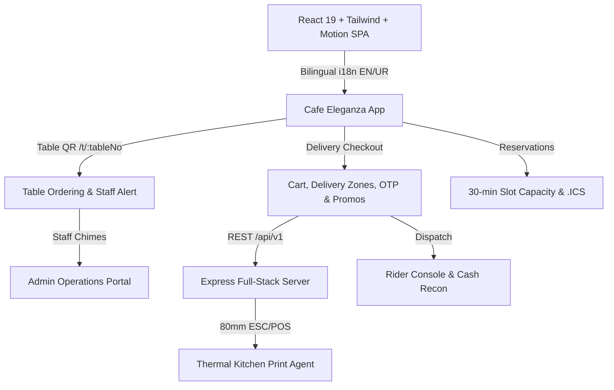

# Cafe Eleganza (Eleganza Solarium)
> **Artisan Coffee, Handcrafted Limka Coolers, East Corner Cuisine & Wood-Fired Sourdough Delights in Faisalabad, Pakistan.**

---

## 🏛️ Architecture Overview



---

## ✨ Features
1. **Bilingual Luxury Experience (English + Urdu):**
   - Instant 1-tap language switch with full RTL mirroring (`dir="rtl"`) and custom **Noto Nastaliq Urdu** font.
   - Every single menu item, category, description, and UI string translated.

2. **Artisan Solarium Design System:**
   - Palette: Deep Forest `#0F3D2E`, Golden Caramel `#C48A4A`, Warm Cream `#F6EFE3`, Roasted Espresso `#2B1B12`.
   - Typography: Fraunces (display), Inter (body), Caveat (accents), Noto Nastaliq Urdu (Urdu).
   - Handcrafted floating SVG iced latte with caramel layers and floating coffee beans drifting on sine paths.

3. **QR Table Ordering (`/t/:tableNo`):**
   - Direct ordering without logins or OTP for dine-in guests.
   - Interactive "Call Waiter" and "Request Bill" staff alerts with sound notification.
   - Admin printable A4 sheet of branded QR cards for all tables.

4. **Express Delivery & Zone Geofencing:**
   - Interactive map pin dropper with point-in-polygon verification for Raza Town, Green Avenue, and West Canal Road.
   - Automatic free delivery calculation (Orders ≥ Rs 3,000) with dynamic progress bar.
   - Pakistani phone number validation (`+92` / `03XX`) and OTP verification.

5. **Kitchen Printing & Thermal Agent:**
   - 80mm thermal ESC/POS receipt generation for browser print and automated background print agent (`/print-agent`).
   - Category-based printer routing (Kitchen vs. Barista Bar).

6. **Full Operations Admin & Rider Hub:**
   - Real-time orders management, rider assignment, and status timeline.
   - Menu item availability toggle (1-tap "86 / Sold Out").
   - Rider delivery app (`/rider`) with tap-to-call and cash reconciliation.

---

## 🚀 Getting Started

### 1. Installation
```bash
npm install
```

### 2. Run Development Server
```bash
npm run dev
```
The full-stack server starts at [http://localhost:3000](http://localhost:3000).

### 3. Production Build
```bash
npm run build
npm start
```

### 4. Admin Credentials & Demo Switcher
Click the shield icon in the top navigation bar to instantly switch between:
- **Admin Portal (`/admin`)**
- **Staff Console**
- **Rider Hub (`/rider`)**
- **Customer Profile (`/profile`)**
